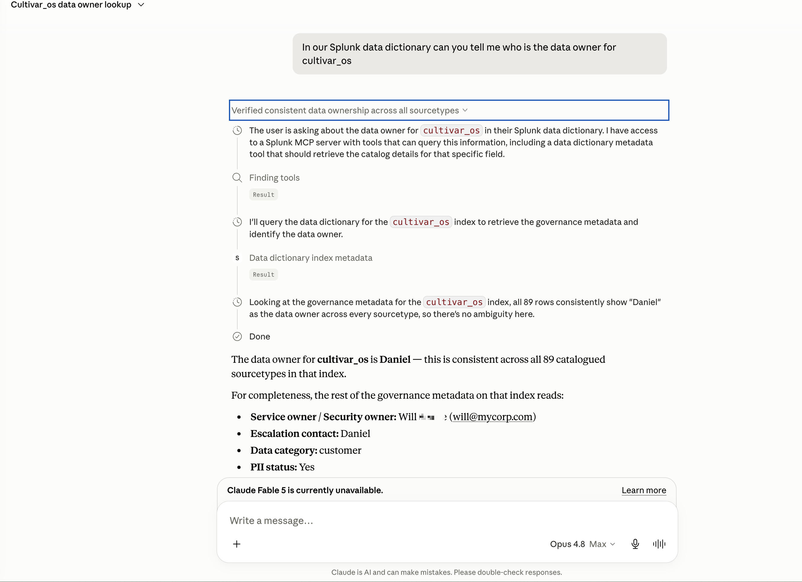
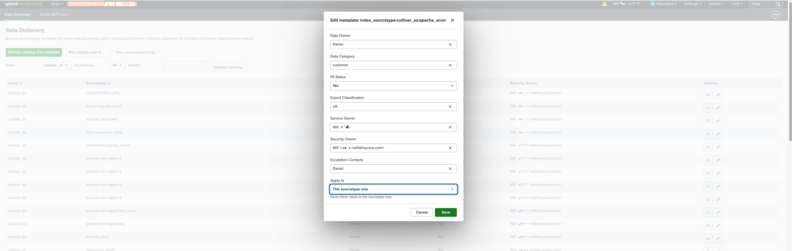

# Splunk Data Dictionary

A Splunk app that **catalogs your indexes and sourcetypes and attaches governance metadata** to them - Data Owner, PII Status, Export Classification, Service Owner,
Security Owner, Escalation Contacts - and then **exposes that catalog to AI agents as Splunk MCP tools** so questions like *"who do I get sign-off from to give a user
access to the cultivar indexes?"* can be answered straight from your favourite MCP-supporting AI system.

Built with the official Splunk **UCC** framework,  Webpack and Splunk React UI libraries `@splunk/react-ui`.

> **Hackathon entry** - This app has been entered into the Splunk Agentic Ops Hackathon 2026, under the Platform & Developer Experience track
>  Licensed Apache-2.0 (see `LICENSE`).
>  Architecture: `architecture_diagram.md`.
>  MCP tool reference: `docs/MCP-TOOLS.md`.

## What it does

- **Catalog** - `(index, sourcetype)` rows from the `data_dictionary_catalog` lookup, populated by the scheduled **"Data Dictionary - Build Catalog"** saved
  search (or on demand from the UI).
- **Governance metadata** - stored in a KV Store collection, keyed `index_sourcetype:<index>:<sourcetype>` (row), `index:<name>` (index), or
  `sourcetype:<name>` (sourcetype), and merged row → index → sourcetype so you set a value once and it inherits. A kvstore lookup (`data_dictionary_metadata`) makes
  it readable in pure SPL.
- **Catalog UI** - a React page (`@splunk/react-ui`) to browse and edit the metadata in the familiar Splunk UI: filter by index/sourcetype, per-row **view / edit** icon actions,
  dropdowns that suggest existing values, **PII Status as Yes/No**, and an **"Apply to"** scope to set metadata for one sourcetype, **all** sourcetypes in
  an index, or only the **un-set** ones. See `docs/screenshots/`.
- **Custom fields** - the standard governance fields ship with the app, but admins can define their own (a **Fields** page: customisable *Select* dropdowns and *Boolean*
  Yes/No). Custom fields appear in the catalogue editor and flow through to the MCP tools automatically.
- **RBAC** - a simple can/cannot-edit model. Browsing and the MCP query tools are open; every metadata / field / catalog-rebuild **write** requires the custom
  `edit_data_dictionary` capability (granted to `admin`; assign it to whichever roles should curate). Enforced server-side; the UI hides edit controls and shows a
  read-only badge for users without it.
- **MCP tools** - the app ships three tools which the Splunk MCP Server registers (`data_dictionary_query`, `data_dictionary_index_metadata`, `data_dictionary_ping`),
  so any MCP client (e.g. Claude) can read the catalog + governance overlays. `ping` runs as SPL; **query** and **index_metadata** run as **API** tools that proxy to the
  app's own REST handlers (returning a flat row array), so all standard + custom governance fields are returned. Reference + captured I/O: [`docs/MCP-TOOLS.md`](./docs/MCP-TOOLS.md).

### Claude Chat example
Providing access to Splunk via Claude allows non-Splunk users, or even existing Splunk users, that allows them to quickly determine the metadata, e.g. security or operational contact, relating to a specific index or data source.


### Web UI Data Dictionary edit/view
Within Splunk you can view, search and modify the data dictionary.


## Quickstart - Splunk Enterprise
# 1. Download latest release
  Navigate to the `Releases` part of this Github repo to download the latest release (.tar.gz) or Splunkbase (Coming soon)

# 2. Upload / Install on your Splunk Enterprise Environment
  See [https://docs.splunk.com/Documentation/AddOns/released/Overview/Singleserverinstall](https://docs.splunk.com/Documentation/AddOns/released/Overview/Singleserverinstall)

## Quickstart - Splunk Cloud
Once the app has passed Splunk Cloud validation this will be updated with install instruction for Splunk Cloud.

## Dev Quickstart (clone -> build -> test -> run)

```bash
git clone https://github.com/livehybrid/splunk-data-dictionary.git
cd splunk-data-dictionary

# 1. Build the installable Splunk app (UCC + Webpack -> stage/, then a tarball)
pip install splunk-add-on-ucc-framework
npm install --legacy-peer-deps
npm run build          # ucc-gen + webpack -> stage/ (complete app)
npm run package        # -> dist/data_dictionary_for_splunk-1.1.2.tar.gz

# 2. Tests (no live Splunk required)
pip install pytest ruff
ruff check tests ucc-app/bin
pytest tests           # tool-signature invariants; live MCP tests auto-skip

# 3. AppInspect (precert) on the package
pip install splunk-appinspect==4.2.1
splunk-appinspect inspect dist/data_dictionary_for_splunk-1.1.2.tar.gz --mode precert
```

Install the tarball via **Apps -> Manage Apps -> Install app from file**, or
`splunk install app dist/*.tar.gz -auth admin:password`.
See [https://docs.splunk.com/Documentation/AddOns/released/Overview/Singleserverinstall](https://docs.splunk.com/Documentation/AddOns/released/Overview/Singleserverinstall) for more info.

## The MCP tools

The app registers its catalog as agent tools. Each one is read-only: `data_dictionary_ping` runs a small SPL template, while `data_dictionary_query` and
`data_dictionary_index_metadata` are **API** tools that proxy to the app's REST handlers (returning a flat row array of catalog + merged governance metadata, custom
fields included). See `docs/MCP-TOOLS.md` for full schemas + real captured output. Future roadmap item to allow updating the data dictionary via MCP:

| Tool | Answers |
| --- | --- |
| `data_dictionary_index_metadata` | Governance/ownership for a **named index** - who owns it, who to get access **sign-off** from, security/service owner, escalation contacts, PII status, classification, per sourcetype. |
| `data_dictionary_query` | **Search across all** indexes/sourcetypes by keyword to find data and its owners/PII/classification (e.g. "who owns the cultivar data?"). |
| `data_dictionary_ping` | Health check + catalog row count. |

Registration: `appserver/static/tool_input_payload_signatures.json` is the single source of truth; `deploy/register_mcp_tools.py` writes each tool (full-doc replace)
into the Splunk MCP Server's `mcp_tools` + `mcp_tools_enabled` KV collections.

## Repository layout

```
ucc-app/                     UCC source of truth: app.manifest, default/ (restmap,
                             web.conf, tools.conf, collections, views, nav, macros,
                             savedsearches), bin/ (one Python REST handler per
                             endpoint), lookups/, appserver/ (templates + the MCP
                             signature JSON).
src/main/webapp/pages/       React entries (Webpack): home/ (catalog editor),
                             fields/ (custom field-definition admin),
                             mcp_tools/ (MCP + REST API docs page).
webpack.config.js            Bundles pages -> stage/appserver/static/pages/*.js and
                             copies the UCC app tree into stage/.
scripts/                     patch-build.js, package.js (tarball), splunk-docker.sh
                             (live-Splunk test harness), generate-licenses.mjs.
tests/                       pytest (tool-signature invariants + live MCP, auto-skipped)
                             + integration/ (Playwright vs live Splunk in Docker).
licenses/                    Generated third-party license attribution.
docker/                      Local Splunk dev harness (compose + Makefile).
.github/workflows/ci.yml     CI (below).
```

## Backend (persistent REST handlers, `ucc-app/bin/`)

One Python module per endpoint - these power the React UI and are also callable
directly (the MCP tools, by contrast, run SPL - see `docs/MCP-TOOLS.md`):

- **ping.py** - health check.
- **discovery_catalog.py / discovery_indexes.py / discovery_sourcetypes.py** -
  catalog + Splunk REST discovery.
- **metadata.py** - list / get / upsert (`batch_save`) / delete governance metadata.
- **dictionary.py / dictionary_query.py** - catalog + merged metadata for one index
  / searched across the estate.
- **options.py** - option lists for the edit-form dropdowns.
- **build_catalog.py** - dispatches the catalog-build saved search (the home page's
  "Run catalog search" button).
- **common.py** - shared helpers (session key, KV REST, lookup loaders).

## Local dev with Docker

```bash
npm run build
cd docker && make up && make wait && make port   # bind-mounts stage/ into Splunk 10
```

Open the URL `make port` prints; login `admin` / `Changeme1!`.

### Full integration harness (app + MCP Server + tests)

```bash
npm run test:integration:full   # build -> Splunk in Docker -> install/configure the
                                # MCP Server + register tools -> live pytest + Playwright
```

This boots Splunk, installs the app, and - when you supply the (third-party)
Splunk MCP Server as `vendor/Splunk_MCP_Server.tgz` - installs/configures it and
registers the tools, then runs the live REST/RBAC/MCP pytest and the Playwright
UI suite (rendering, RBAC, custom fields). See
[`docs/INTEGRATION-TESTING.md`](./docs/INTEGRATION-TESTING.md).

## Built & validated by GitHub Actions

Every push / PR is built, validated and tested by [`.github/workflows/ci.yml`](./.github/workflows/ci.yml).
It reuses **existing/official Splunk pipelines**: AppInspect runs via the shared [`livehybrid/deploy-splunk-app-action`](https://github.com/livehybrid/deploy-splunk-app-action)
reusable workflows (the same ones the other livehybrid Splunk apps use), which wrap Splunk's official `splunk/appinspect-cli-action` + `splunk/appinspect-api-action`;
the build uses Splunk's official **UCC** (`ucc-gen`).

| Job | What it does |
| --- | --- |
| **python** | `ruff` + `pytest` (tool-signature invariants; live MCP tests auto-skip). |
| **node-build** | `ucc-gen` + Webpack build + package; uploads the tarball as the `dist` artifact. |
| **quality-appinspect** | AppInspect **CLI** via the reusable pipeline → Splunk's official action (`cloud` tag). |
| **quality-appinspect-api** | AppInspect **API** (cloud vetting) via the reusable pipeline → Splunk's official action. |
| **integration** | Boots Splunk 10 in Docker, installs the built app, runs Playwright against the **real** REST handlers + React bundles, tears down. |
| **licenses** | Regenerates third-party license attribution (`npm run licenses`) and uploads it. |
| **publish** | On a `v*.*.*` tag: publishes a GitHub Release with the (tag-versioned) tarball, via the reusable `publish.yml`. |

## Roadmap

- **Shipped** - **custom metadata fields** (admin-defined Select/Boolean fields, surfaced to the UI and MCP tools); **RBAC** (the `edit_data_dictionary` capability gating
  all writes); the read tools moved to **API execution** proxying the app's REST handlers.
- **Automated Splunkbase publish** is wired (reusable `publish.yml` on `v*` tags); next is a broader **Splunk version test matrix** (`splunk/addonfactory-test-matrix-action`).
- **Update data dictionary from MCP** - the MCP tools are currently retrieval-only. The `edit_data_dictionary` capability now provides the RBAC foundation, so write-capable
  MCP tools (CRUD) could be added that enforce the same capability before mutating the catalog/dictionary.

## Requirements

- Splunk Enterprise or Cloud 9.x+ (targets 10.x; `python.required = python3`).
- KV store enabled (default on search heads).
- For the MCP tools: a Splunk MCP Server that imports app tool signatures.
