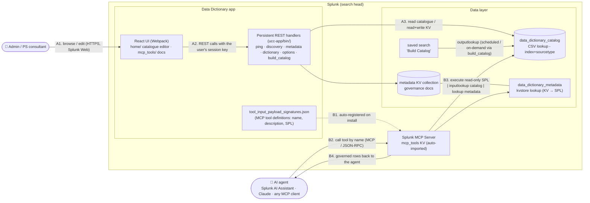

# Architecture - Splunk Data Dictionary

The application catalogues every `(index, sourcetype)` pair in a Splunk estate and
attaches **governance metadata** to it (data owner, security/service owner,
escalation contacts, PII status, data category, export classification). It then
surfaces that catalogue two ways: a **React UI** for people, and **Splunk MCP
tools** for AI agents. There is no LLM inside the app - the intelligence sits in
whatever agent calls the tools; the app's job is to give that agent accurate,
governed answers about the data estate.

> This diagram renders natively on GitHub. The three labelled flows map to the
> sections below: **(A)** how the app interacts with Splunk, **(B)** how AI agents
> are integrated, and the **data flow** between services, APIs and components.

## A. How the app interacts with Splunk

The app is a **native UCC-built Splunk app** that runs entirely on the search head.

- **UI → REST.** The React pages (`@splunk/react-ui`) call the app's **persistent
  REST handlers** (`ucc-app/bin/`, registered in `restmap.conf`) using the
  logged-in user's **Splunk session key** - so all access honours normal Splunk
  RBAC. No external service is involved.
- **Catalogue.** Index/sourcetype rows live in the `data_dictionary_catalog` CSV
  lookup, populated by the **"Data Dictionary - Build Catalog"** saved search
  (scheduled, or dispatched on demand by the `build_catalog` handler behind the UI's
  "Run catalog search" button).
- **Governance metadata.** Held in a **KV Store** collection and read/written through
  the `metadata` handler (`batch_save`). A kvstore lookup
  (`data_dictionary_metadata`) exposes it to SPL. Metadata is keyed at row
  (`index_sourcetype:<index>:<sourcetype>`), index (`index:<name>`) or sourcetype
  (`sourcetype:<name>`) level and **merged row → index → sourcetype** on read.

## B. How AI models / agents are integrated

The app contains **no LLM**; it integrates with agents by **publishing tools**, not
by calling a model.

- **Tool definitions** ship in `appserver/static/tool_input_payload_signatures.json`.
  The **Splunk MCP Server automatically imports** them into its `mcp_tools` KV
  collection on install - no manual registration.
- The three tools - `data_dictionary_index_metadata`, `data_dictionary_query`,
  `data_dictionary_ping` - are **read-only and execute as SPL**
  (`| inputlookup data_dictionary_catalog | lookup data_dictionary_metadata …`), so
  they overlay governance onto catalogue rows with no `| rest` and run safely inside
  the MCP search sandbox.
- Any **MCP client** can call them: Splunk's own **AI Assistant**, **Claude**, or a
  bespoke agent. The agent reads each tool's name, description and input schema, calls
  it by name, and receives governed rows - which it uses to answer the user (e.g.
  "whose sign-off do I need for the cultivar indexes?"). The descriptions are written
  in governance/ownership language so agents reliably select the right tool.

## Data flow between services, APIs and components

**Human curation (write path):**

1. Consultant opens the catalogue UI in Splunk Web → React `home/` page.
2. UI calls `GET /data_dictionary/discovery/catalog` and `/metadata` (session key).
3. On save, UI calls `POST /data_dictionary/metadata/<key>` → handler `batch_save`s
   the governance document into the KV Store. "Apply to index" fans the same values
   across every (or only the un-set) sourcetype in the index.

**Agent query (read path):**

1. Agent (e.g. Splunk AI Assistant) calls `data_dictionary_query` over MCP with a
   keyword such as `cultivar`.
2. The MCP Server runs the tool's SPL template:
   `| inputlookup data_dictionary_catalog | lookup data_dictionary_metadata … | where …`.
3. SPL reads the catalogue lookup and overlays governance from the KV-backed
   `data_dictionary_metadata` lookup.
4. Governed rows (owners, escalation contacts, PII, classification) return to the
   agent, which answers the user in natural language.

The catalogue is the single source of truth: humans curate it through the REST API;
agents read it through MCP tools that run deterministic, read-only SPL over the same
lookups.
